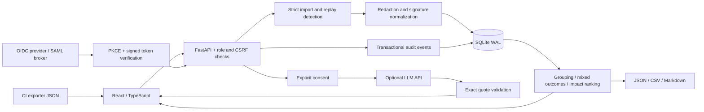

# CI Failure Triage — Alan Vo

Current version: `1.0.1`.

Import CI run records, inspect normalized failure signatures, identify same-commit mixed outcomes, and manage remediation with evidence and a human audit trail. This is a deployable FastAPI/React workspace for teams whose CI dashboard says *failed* but does not explain which failures deserve attention first.

The app does not scrape CI vendors, run imported commands, modify repositories, retry builds, or claim to know a failure's root cause. Bring JSON records from your existing CI exporter. Retained evidence remains useful without an LLM account.

## Three complete workflows

1. **Import and investigate.** Import a run with job outcomes, durations and logs. The server validates limits, rejects conflicting replays, discards full logs after extracting bounded redacted excerpts, and groups failure signatures. Import successful reruns as well to reveal same-commit mixed outcomes.
2. **Prioritize and triage.** Inspect exact excerpts and original-log hashes, review sample size and failure-rate uncertainty, assign an owner, and record a reasoned state change. Revision checks prevent lost updates. A failure observed after resolution reopens its group; older historical imports do not.
3. **Compare and report.** Split retained runs at a timestamp, compare signature counts, run normalization diagnostics, export JSON/CSV/Markdown, and inspect the mutation audit. Optional model suggestions must cite a retained run and exact source quote before they appear.

## Architecture



Backend modules separate import models, fingerprints, analysis, export formatting, storage, authentication and provider adapters. SQLite serializes mutations; triage uses optimistic revisions. The frontend exposes imports, an evidence board, retained runs, comparisons, diagnostics and audit history. This release supports one application process and one shared workspace, not tenant isolation or horizontally scaled writes.

## Local installation

Requirements: Python 3.11+ and Node 20+.

```sh
python3 -m venv .venv
.venv/bin/pip install -r backend/requirements.txt
cd frontend
npm ci
cd ..
```

Run the backend with explicitly local demo authentication:

```sh
APP_ENV=development AUTH_MODE=demo COOKIE_SECURE=false BIND_HOST=127.0.0.1 \
  .venv/bin/uvicorn app.main:app --app-dir backend --host 127.0.0.1 --port 8000
```

In a second terminal:

```sh
cd frontend
npm run dev
```

Open `http://127.0.0.1:5173`. Choose **Demo admin** to import, triage and test retention. Demo reviewer can import and triage but cannot delete runs. These identities are demonstration accounts, not production credentials. `APP_ENV=production` rejects demo mode.

Select **Import** and load the example. To observe a possible flaky job, import a second record with the same repository/workflow/branch/commit/job/test, `attempt: 2`, `status: "success"`, and its actual successful duration. The first failure then links to the successful run as mixed-outcome evidence. Do not manufacture success records for real investigations.

## Production and SSO/SAML

Copy `.env.example` to `.env`, configure your identity provider, and serve the frontend through an HTTPS reverse proxy. Set:

- `AUTH_MODE=oidc`, `APP_ENV=production`, `COOKIE_SECURE=true`.
- `OIDC_DISCOVERY_URL`, `OIDC_CLIENT_ID`, and `OIDC_CLIENT_SECRET` if your client requires it.
- `FRONTEND_URL` to the public HTTPS origin and `OIDC_REDIRECT_URI` to that origin plus `/api/auth/callback`.
- `OIDC_ROLE_CLAIM` to the claim path containing `viewer`, `reviewer`, or `admin` roles; default `realm_access.roles`.

```sh
docker compose up --build -d
```

Compose binds the frontend to `127.0.0.1:8090`; the backend is internal. The named `triage-data` volume persists the database. Terminate TLS at your existing reverse proxy. The backend container runs as a non-root user and has a health check. Back up the SQLite database consistently before upgrades; retain backups outside the container volume.

OIDC login uses authorization code flow with PKCE, state and nonce, signed ID-token verification, issuer/audience/expiry checks, and single-use login state. Browser sessions use opaque HTTP-only cookies; mutating API calls require the session's CSRF token. No GitHub PAT is required by this application.

For **SAML**, configure a SAML identity source behind an OIDC broker such as your organization's identity gateway. This app consumes the broker's OIDC interface; it does not parse SAML assertions directly. A `viewer` reads all workspace data, a `reviewer` imports and triages, and an `admin` additionally deletes retained runs. There is no per-repository access segregation.

## Optional LLM APIs

One credential variable, `LLM_API_KEY`, is used for all hosted providers. The app infers common key families for OpenAI-compatible, Anthropic or Gemini; set `LLM_PROVIDER` to override. Custom endpoints cannot be inferred from a key alone: set `LLM_BASE_URL` and `LLM_MODEL` as needed. For local Ollama, use `LLM_PROVIDER=ollama` and optionally `LLM_MODEL`; a credential is unnecessary.

Supported protocols: OpenAI chat completions (including compatible gateways), Anthropic messages, Gemini generateContent and Ollama's OpenAI-compatible API. Provider, endpoint and model are operator settings. Model access and usage costs are controlled by your provider; no request runs automatically. No key is sent to the browser.

The Analysis panel requires consent for every advice action. It sends at most ten groups with two retained occurrences each, capped at 40,000 input characters. Output is bounded and must reference a submitted group/run and an exact nonempty quote. That proves source linkage, **not correctness of the proposed investigation**. Recommendations never execute or modify triage. Provider failure returns a safe error while deterministic analysis and saved work remain intact.

## Import contract

```json
{
  "external_id": "build-101",
  "attempt": 1,
  "repository": "example/payments",
  "workflow": "CI",
  "branch": "main",
  "commit": "abcdef1234567890",
  "started_at": "2026-01-01T10:00:00Z",
  "jobs": [{
    "name": "unit-tests",
    "test": "checkout retries",
    "status": "failure",
    "duration_seconds": 180,
    "log": "Error: connection timed out after 200ms"
  }]
}
```

Each `(repository, workflow, external_id, attempt)` identifies one immutable imported record. Identical replays return the original ID with `replayed: true`; changed content returns 409. Job/test pairs must be unique within a run. The commit must be 7–64 hex characters; use full hashes to avoid ambiguous short IDs. Timestamps require a timezone. Unknown fields and nonfinite durations are rejected.

Limits: 100 jobs/run, 100,000 log characters/job, one million combined log characters/run, 500 retained runs, 20,000 audit mutations. Job duration is 0–86,400 seconds. The body limit defaults to 5 MiB. After reaching audit capacity, export and archive the workspace database and provision a fresh one; audit events are never silently deleted. The UI shows the latest 500 audit events. Admin retention removes a run and its excerpts from reports while preserving its deletion reason and original record digest.

## Analysis semantics

- The last recognized error line forms the signature. It is a heuristic, not causal analysis. Nearby redacted lines are retained for inspection, capped at 4,000 characters.
- ANSI codes, timestamp/clock volatility, UUIDs, memory addresses, source positions and explicit duration strings are normalized. HTTP/error codes and expected/actual assertion values remain intact.
- Fingerprints are scoped to repository, workflow, job and test. Branches share remediation groups, but mixed outcomes are compared only within the same branch and commit.
- A failure plus a success on that commit is a **candidate** for flakiness. Infrastructure changes, partial imports, changed dependencies or environment differences can explain it. Cancelled and skipped outcomes are excluded from failure rates.
- Wilson 95% intervals describe observed success/failure counts. Selection bias and dependent reruns violate simple sampling assumptions; the interval is descriptive, not a certification.
- Failed-job minutes are summed elapsed durations, not CPU utilization or human time. Estimated impact adds an explicit investigation-minutes-per-failure assumption (default 10). Adjust it to your team; do not present the result as measured productivity loss.
- Deleting evidence changes reports. A signature absent from a later time sample is not automatically marked resolved. Human state and audit records persist even when their original run has been removed.
- Best-effort secret redaction recognizes common assignment, bearer, token and URL-credential forms. Review logs before importing. Arbitrary secrets may remain; the server does not promise complete sanitization.

## API reference

Interactive schema: `/docs`; machine-readable schema: `/openapi.json`. Authenticate in the browser or through the OIDC flow, retain the session cookie, and use `X-CSRF-Token` from `/api/auth/me` for mutations.

| Method | Endpoint | Purpose / role |
|---|---|---|
| GET | `/api/health` | Public health and version |
| GET | `/api/auth/mode`, `/api/auth/me` | Authentication mode / current user |
| GET | `/api/auth/login`, `/api/auth/callback` | OIDC flow |
| POST | `/api/auth/logout` | End session |
| POST | `/api/runs` | Import strict Run JSON; reviewer |
| GET | `/api/runs` | List records; optional repository/branch filters |
| GET | `/api/runs/{id}` | Redacted retained evidence and provenance |
| DELETE | `/api/runs/{id}` | Admin retention with JSON `reason` |
| GET | `/api/report` | Prioritized groups; repository/branch and investigation_minutes (0–480) |
| PUT | `/api/groups/{id}` | Reviewer triage: revision, status, owner, note |
| GET | `/api/compare` | Before/after samples at timezone-aware `split` |
| GET | `/api/export/{format}` | json, csv or markdown; same report filters |
| GET | `/api/audit` | Latest 500 mutation events |
| GET | `/api/evaluation` | Reproducible normalization corpus |
| POST | `/api/advice` | Reviewer; `{"consent":true}` and optional repository/branch filters |

Triage statuses: new, investigating, resolved, ignored. Every mutation requires a substantive note, and states other than new require an owner. Initial revision is 0; saving increments it. A stale revision returns 409. Domain errors use `{"error":{"code":"...","message":"..."}}`; schema validation uses FastAPI's 422 `detail` response. No error response includes provider credentials or upstream response bodies.

## AI/ML evaluation and tests

```sh
.venv/bin/python -m pytest backend/tests -q
cd frontend
npm run build
npm test -- --run
```

The evaluation endpoint exposes all 12 labeled normalization pairs and their expected/actual outcomes. It checks preservation of semantic values and removal of known volatility. This tiny handwritten fixture set is regression evidence, not broad NLP accuracy. Backend tests exercise conflicting replays, concurrent imports, mixed-outcome scope, human revision conflicts, redaction, retention, exports, role/CSRF enforcement, and signed OIDC flows. Frontend tests cover imports, conflicts, read-only state and explicit model consent. CI runs backend tests, TypeScript build/frontend tests, and both Docker builds.

## Ownership

Alan Vo · [alanvo@gmail.com](mailto:alanvo@gmail.com) · MIT license.
